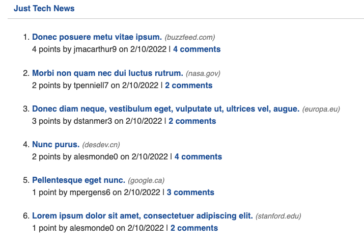
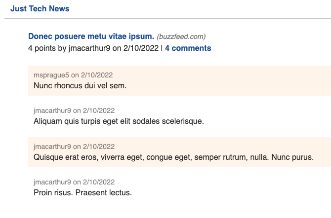

# Just Tech News

- Object-Relational Mapping (ORM)
- Model-View-Controller (MVC)

## Description

This app shows the tech news posted by users. Users can login to create/edit/delete posts, as well as make new comments and upvotes to current posts.

## Installation

```
npm init -y
npm install express sequelize mysql2 dotenv bcrypt
npm i jest -D
npm i express-handlebars express-session connect-session-sequelize

mysql -u root -p
source db/schema.sql
quit

npm run test
npm run seed
npm start
```

Add/edit the following code to package.json:

```json
  "main": "server.js",
  "test": "jest",
  "start": "node server.js",
  "seed": "node seeds/index.js"
```

## Application deployed on Heroku

- [Heroku link](https://just-tech-news-2022.herokuapp.com/)
- Deploy with seeds to heroku: add `JawsDB MySQL` on Resources tab

```
heroku create
git push heroku main
heroku run node seeds/index.js
```

### App Screenshot





## Contribution

Made by Wenwen Tian

## Test Instructions

To run tests for this application, you can run the following command:
`npm run test`

## Questions?

Please feel free to contact me if you need any further information:

- [Email](mailto:wwtian9@gmail.com)
- [Github Profile](https://github.com/joce1ynn)
